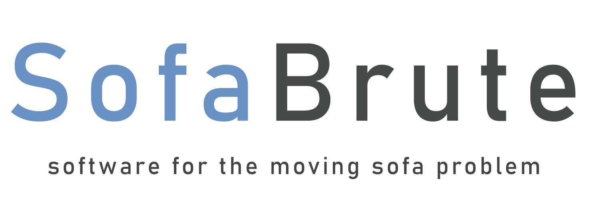
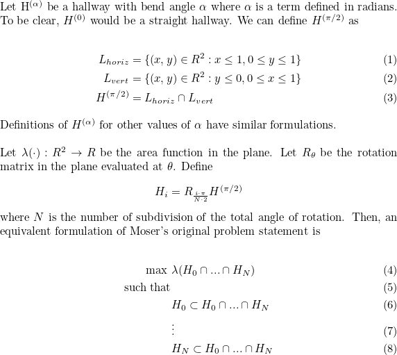
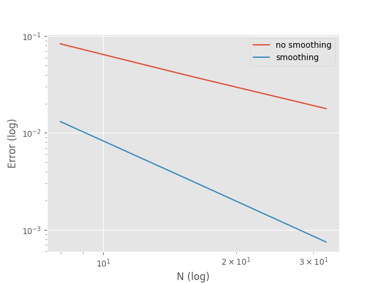

<p align="center">
  
</p>

## What is SofaBrute?
SofaBrute is a tool written in Python which aims to help researchers understand the rotation path of the (conjectured) omptimal sofa as a function of the hallway angle. SofaBrute does this by "brute forcing" (see algorithm section) its way to a (conjectured) optimal sofa, and then saving plots of the sofa in the hallway at various points through its rotation to the local folder. SofaBrute was originally concieved as companion software to a research paper I wrote during the last quarter of my undergraduate degree in Math and Scientific Computation at UC Davis. 

## Table of Contents
- [A Brief History of the Problem](#a-brief-history-of-the-problem)
- [Algorithm](#algorithm)
- [How to Use](#how-to-use)
- [How Does Smoothing Effect Convergence?](#how-does-smoothing-effect-convergence)
- [Dependencies](#dependencies)
- [Questions?](#question)
- [Disclaimer](#disclaimer)

## A Brief History of the Problem
In 1996, Leo Moser asked the question "what is the shape of largest area in the plane that can be moved around a right-angled corner in a two-dimensional hallway of width 1?" This problem statement became known as the moving sofa problem. A specific construction was given by Joseph Gerver in 1992 which he conjectured to be the solution to Moser's problem. However, Gerver was unable to give proof and to this day his conjecture remains unproven.

## Algorithm
The algorithm aims to solve a reformulated (but equivalent) version of the problem. Since GitHub does not support LaTex markdown, see the below image for the formulation.

<p align="center">
  
</p>

The algorithm aims to solve this optimization problem by modifying the positions of H_0, ..., H_N one at a time. Starting with H_0, the algorithm will "wiggle" the hallway and see if the wiggle resulted in a larger intersection area. If the wiggle resutls in a decrease or no change at all to the area, the algorithm places H_0 back in its pre-wiggle position and moves to H_1, H_2, etc. Wiggling is always done by pushing H_i parallel to its edges. If the algorithm is unable to find an area-increasing move for any of the rotated hallways, the algorithm will begin decreasing the "size" of the wiggle. If the algorithm is unable to find an area-increasing move after 4^(N+1) wiggle attempts, the algorithm terminates.

This method was inspired by Joseph Gerver's "balanced condition" which a solution to the moving sofa problem must satisfy. See theorem 1 of his paper for more information.

## How to Use
Upon running the program, the user will be prompted with four parameters to set. 
1. The user will be asked to set an angle value. This value corresponds to the angle of the bend of the hallway. The expected value is in (0, 180) and is a measure of degrees.
2. The user will be asked how many anchor points they would like to use. This value corresponds to the number of hallways used for the intersection. To state this in the language used under the algorithm section, this value sets N. The expected value is any natural number greater than 4.
3. The user will be asked to enable or disable smoothing. If enabled, this option will smooth the boundary of the sofa which corresponds to that defined by the rotation path. This is done by picewise linear interpolation. 
4. The user will be asked whether they would like to save a moving plot set to the local folder or not. If the user enables the saving feature, N (the number of anchor points) plots will be saved to the local folder. The kth plot will contain in it the sofa shape which results from the intersection of all hallways, and the kth hallway outline. This is meant to provide the user a way to analyze the the movement of the hallway around the sofa.

## How Does Smoothing Effect Convergence?
Without smoothing, for the 90-degree hallway case, the algorithm converges to the true area of Gerver's sofa linearly as a function of N. With smoothing, the algorithm converges quadratically as a function of N. 

<p align="center">
  
</p>

## Dependencies
* ```shapely``` is required to handle the creation and manipulation of polygon objects.
* ```numpy``` is used to make the math more compact.
* ```matplotlib``` is required to handle plotting.
* ```scipy``` is required to handle interpolation.
* ```descartes``` is used to enhance plotting.

## Questions?
Please feel free to get in touch if you have any questions about the program. I am happy to respond to emails. You can contact me at jjfields [a][t] uw [d][o][t] edu.

## Disclaimer
This program was originally concieved as a ~100 line tool I quickly wrote up to explore some ideas computationally. Slowly, it evolved into what it is today. As a result, the code is in no way polished or optimized. I have largely left all of my notes to myself in the program, and I've only removed unused code which I think could be confusing.
